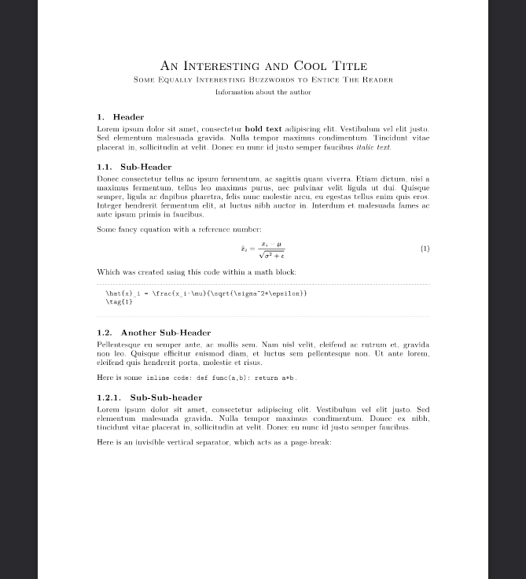

# Obsidian Acadamic Export
**NEW**: If you are interested in making your academic writing easier, take a look at [this LaTeX class](https://github.com/NicklasVraa/Latex-academic-class), which was made to address the limitation of this snippet-based approach.

Here you will find an Obsidian css-snippet, which will format pdf-exports as academic writing akin to LaTeX compilation. Simply place `academic-pdf-export.css` in your obsidian snippets folder and activate it in settings. Tested with minimal-theme.

Consider this a starting point. Pull-requests and forks are very welcome.

This css-snippet uses the 'Latin Modern' font family - a LateX font clone, which may have to be installed separately, or you can simply change the fonts in the css to something else, e.g. 'Times New Roman'.

## Example
To the left is shown obsidian in source mode, i.e the source code. To the right is the exported pdf.
| Source                           | Build                          |
|----------------------------------|--------------------------------|
|  |  |
|  |  |
|  |  |

`UI-tweaks.css` will make Obsidian preview mode better resemble what is being exported.
